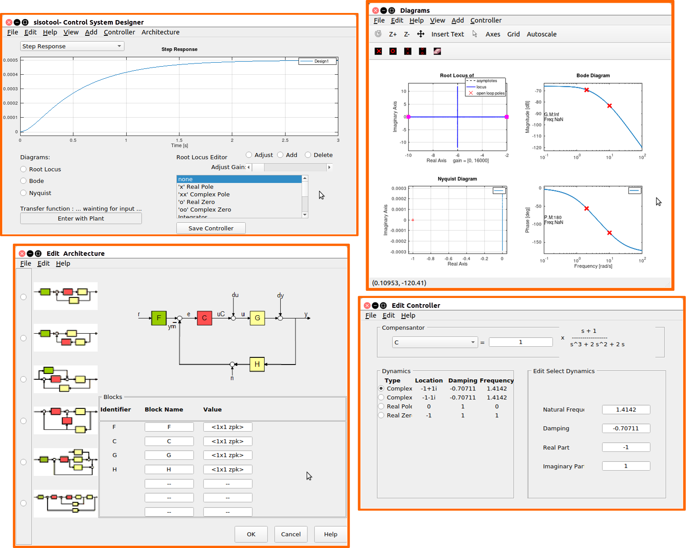

Interactive Tool for Single Input Single Output (SISO) Linear Control System Design
=====================================================================================

The Interactive Tool for Single Input Single Output (SISO) Linear Control System Design let you design SISO controllers for feedback system modeled in GNU Octave.

Currently, it presents the following functionalities::

 - Interactive plots: Bode, Root Locus and Nyquist diagrams;
 - Root Locus graphical editos for adding, modifyng, and removing controller poles, zeros and gains.
 - Analyze control system designs using time-domain by step responses.
 - Save the controller to workspace.
 - Arbitrary list of response plots.
 - Compare response plots for multiple control system designs.
 - Tune compensators for different loop control structures.

    

Installation
========================

To get the latest updates as they come, install sisotool from git. To download the repository execute the following from the command line::

   $ git clone git@github.com:EriveltonGualter/octave-control.git

To update to the latest version, go into your repository and execute:

   $ git pull origin master

Open GNU Octave and go to the folder octave-control/TARGET. Then, run the following commands to install::

   $ pkg install control-3.1.0_gsoc.tar.gz

After installation, you need to load the control package and finally run the sisotool as following:

   $ pkg load control

